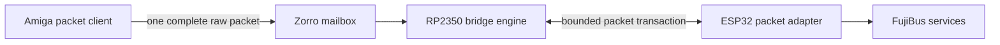
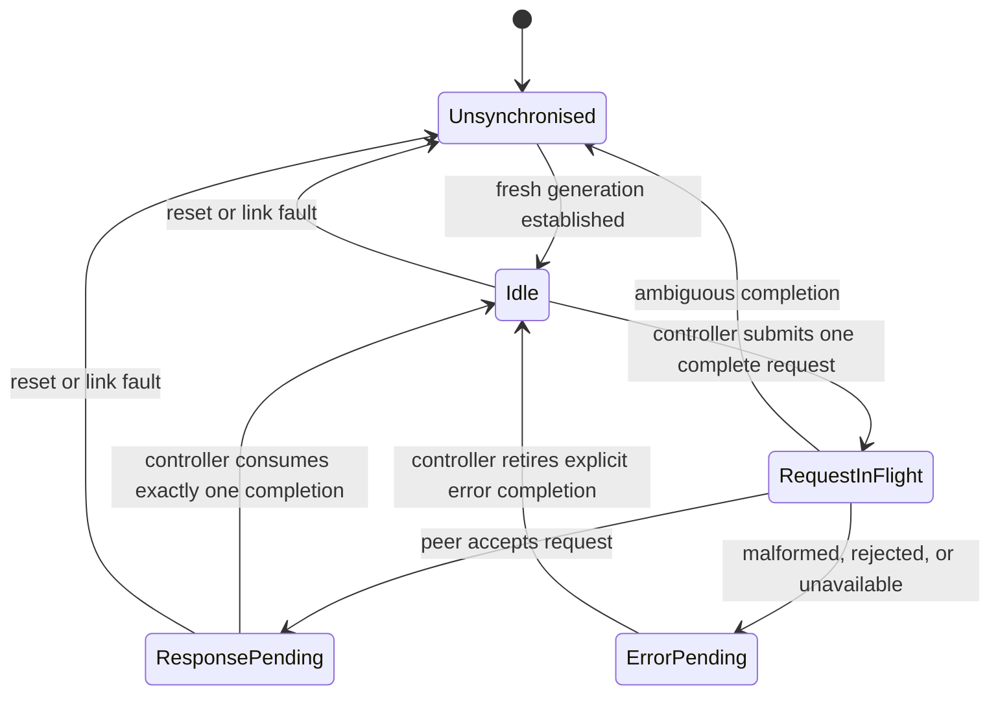

# Bridge packet ABI — review draft

**Status:** Draft for Story 2.4 design review. This document proposes the first
production contract; it is not approved for implementation yet.

The contract joins the Amiga-facing bridge endpoint to the ESP32 service through
the RP2350. It carries complete, opaque canonical FujiBus raw packets. It does
not define FujiBus services, replace the software packet contract, or turn the
laboratory test envelope into production wire format.

## Evidence and authority

The canonical software semantics remain
[the native packet contract](../../docs/native-packet-contract.md): raw packets,
whole-packet ownership, separately observable outcomes, bounded work, and
unknown completion. This document chooses the hardware behavior required to
honour those semantics.

The choices below are based on:

- Story 2.2 C0–C9: RP2350 passive capture and control feasibility;
- Story 2.3 L0–L10, indexed in the
  [link-feasibility evidence ledger](link-feasibility-evidence.md);
- in particular, L2 partial/oversize rejection, L5 re-arm behavior, L6/L7 reset
  containment, L8 rate boundary, L9 error-completion retirement, and L10 phase
  timings.

C10 remains passive real-bus evidence collection. Its result must be reviewed
before the final Zorro register addresses, output timing, or electrical details
are approved. It does not prevent review of the packet and link rules here.

## Proposed ABI boundary

A packet is the exact `serializeRaw()` representation. There are no SLIP bytes,
service translations, or hidden retries at either hardware boundary. A completed
response is likewise one canonical raw packet.

The first ABI uses one outstanding Amiga-originated exchange. An exchange is:

1. the host publishes one request packet;
2. the RP2350 accepts it and forwards it to the ESP32;
3. the ESP32 returns exactly one completion: a response packet or explicit
   error; and
4. the RP2350 publishes that completion to the host before accepting another
   request.

ESP-originated notifications and multiple concurrent requests are deliberately
outside ABI version 1. They can be introduced by a later version with explicit
queue/credit semantics. L4/L5 establish that opposite-direction traffic is
feasible; they do not require us to make it part of the initial ownership model.

## Capacity and packet validity

Each endpoint exposes one immutable `packet_capacity` in bytes. A packet is
accepted only when all of the following are true:

- it is nonempty;
- its complete raw byte count is no greater than `packet_capacity`;
- its declared raw length equals the supplied byte count; and
- its canonical checksum and descriptor structure validate.

A packet is never exposed, forwarded, or accepted as a prefix. Oversize,
truncated, malformed, and checksum-failed input has an explicit error outcome.
Trailing bytes from an earlier slot must not be interpreted as part of a later
packet.

**Review decision C1 — initial capacity:** the proven lab transport capacity is
240 payload bytes in a 256-byte test slot. That is evidence for a minimum
implementation capability, not evidence that 240 bytes satisfies every FujiBus
workload. Before approval, select one of:

- a fixed production raw-packet capacity and a defined `Oversized` result; or
- a bounded fragmentation/reassembly design, with its own ownership and reset
  rules.

Version 1 must choose one. It must not silently truncate or stream raw packets.

## Link session, ownership, and completion

The RP2350 is the link-session controller. It owns the transition into a new
session generation and serializes transactions. `READY` and `DATA_AVAILABLE`
are transport flow-control signals, not packet boundaries and not durable
completion records.

Normative rules:

- A sender may submit only in `Idle`.
- The receiver may accept only one complete request in the current generation.
- A completion is either one complete response packet or one explicit error
  completion. Both consume the request.
- A controller must wait for and retire an explicit error completion before it
  submits another request. It must not infer retirement from a previously cached
  GPIO level.
- `READY` must make a new generation observable before the controller clocks the
  next slot. The precise electrical interval belongs to the board/link profile,
  but must be documented and testable.
- A persistent level alone does not identify a new response. Completion identity
  comes from the current generation plus the serialized transaction state.

The L5 and L9 findings are the reason for these rules: a level remaining high
or an error response that has not yet been advertised can otherwise be mistaken
for a later transaction.

## Outcomes

The bridge maps link outcomes to the software packet contract without concealing
remote uncertainty.

| Condition | Required ABI outcome | Next action |
| --- | --- | --- |
| Exact response packet | `Ok` | Deliver one packet; return to `Idle`. |
| No locally accepted request | `Backpressure` or `NoData` as applicable | Leave current generation unchanged. |
| Empty, oversize, malformed, or partial input | Explicit error completion | Retire it before another request. |
| Peer definitely unavailable before acceptance | `Unavailable` | Enter `Unsynchronised`. |
| Definite peer rejection | `SendFailed` or defined rejection status | Return only after that completion is retired. |
| Reset, timeout, or any state where remote acceptance/effect is unknown | `UnknownCompletion` / `ResetRequired` | Quarantine the exchange; establish a fresh generation. |

No endpoint retries a request automatically after `UnknownCompletion`. The
caller may choose a new request only after the higher-level recovery policy has
established a new session. This preserves the existing native packet contract's
at-most-one-remotely-in-flight containment.

## Reset and generation

A reset, peer disappearance, or link fault invalidates every in-flight request,
response, queue entry, and completion indication in the affected generation.
Neither endpoint may present a retained partial packet or late completion as a
packet in the next generation.

A fresh generation requires all of these actions:

1. discard local queued/incomplete packet state;
2. withdraw ordinary flow-control assertions;
3. establish that both endpoints have entered the new generation; and
4. only then allow the RP2350 controller to submit an `Idle` request.

The concrete representation is a **review decision C2**. It may be a reset
counter/token exchanged in a control transaction, or an equivalent explicit
synchronization handshake. It must not depend solely on boot order, elapsed
time, an empty local queue, or a GPIO level read once.

L6 establishes that a stale error can be retired across an RP2350 RAM reload.
L7 establishes controlled peer restart detection at a stable boundary. They
support this rule; they do not prescribe the production synchronization format.

## Physical link profile

ABI version 1 uses an RP2350-controlled SPI link plus explicit flow control.
The production packet ABI does not embed a fixed SPI clock rate. The board
profile selects a rate validated for its wiring and electrical design.

The current long-Dupont breadboard fixture repeatedly passed 64- and 240-byte
payloads at the RP2350's actual 6.818 MHz divider rate. At actual 7.5 MHz it
showed intermittent returned-frame checksum failures. Therefore no production
rate is approved by this draft; a board profile must use a validated rate for
that board and be requalified on the controlled production hardware.

DMA is permitted as an implementation detail. L10 shows it does not alter the
current contract or improve the current fixture's end-to-end throughput, so it
is not an ABI feature.

## Zorro-facing mailbox profile

The Amiga-facing endpoint exposes the same whole-packet, one-outstanding
exchange contract. It must give the client explicit states for:

- bridge unavailable;
- request accepted and in flight;
- exact response ready;
- definite request rejection; and
- unknown completion/reset required.

The RP2350 must not expose a packet as ready until the complete raw packet is
stored and validated. The Amiga client must not reuse a request slot until the
bridge has accepted it. A reset or uncertain completion discards the mailbox
contents and reports uncertainty; it does not manufacture a response or retry.

**Review decision C3 — register/mailbox encoding:** C10 evidence and board
schematic review must select register addresses, byte/word access rules,
interrupt/doorbell behavior, buffer placement, and passive/active bus timing.
Those are intentionally absent from this draft. They are electrical and Zorro
bus details, not missing link semantics.

## Required conformance vectors

Any implementation of version 1 must demonstrate, with independent endpoints:

1. exact canonical raw request/response at representative sizes and binary
   values, including `00`, `C0`, and `DB`;
2. declared maximum size accepted and maximum-plus-one rejected;
3. truncated/checksum-failed input produces one explicit error completion and
   does not contaminate the next request;
4. `READY` re-arm/new-generation behavior cannot cause a stale response to be
   consumed as a new one;
5. reset of either side with a pending transaction yields `UnknownCompletion` or
   a defined explicit error, then requires a fresh generation;
6. no automatic replay after ambiguous completion; and
7. one host-originated request remains the maximum concurrently accepted work.

The existing L0–L10 fixtures provide most link-side vectors. Story 3 must add
Zorro-mailbox and independent bridge/ESP endpoint conformance fixtures before
shipping.

## Approval checklist

Approve this document only after reviewers decide and record:

- C1: the production raw-packet capacity or fragmentation design;
- C2: the concrete fresh-generation synchronization format;
- C3: Zorro mailbox/register and electrical timing profile after C10 review;
- the board-profile rate and the performance requirement it must meet; and
- versioning/reserved fields for a future queued or ESP-originated extension.

Until then, this document is the proposed semantic ABI. It authorizes no
production register map, firmware ABI, or service integration.
