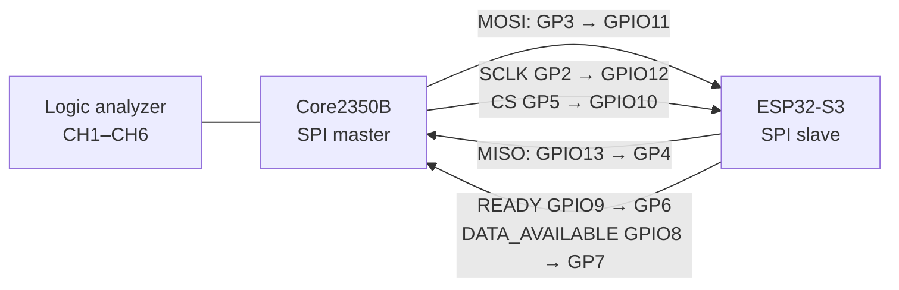
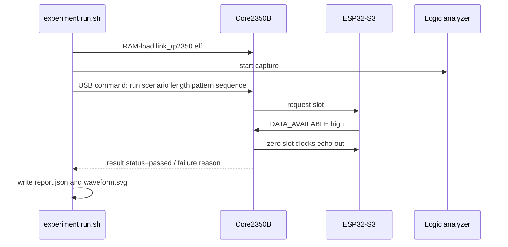

# Story 2.3 link-lab implementation

This directory is a small, isolated hardware lab for the RP2350B ↔ ESP32-S3
link. It tests a fixed test slot, not a FujiNet production protocol or ABI.
The story plan explains what each L experiment proves; this page explains how
the lab code carries it out.

## Endpoints and wires

The Core2350B is the SPI master. The ESP32-S3 is the SPI slave. Both endpoint
images use the same `link_test_frame`: a fixed 256-byte slot containing a magic,
scenario, sequence, length, payload, and CRC16.

`READY` means that the ESP has already queued one complete SPI slot. When it
has prepared an echo, it also raises `DATA_AVAILABLE`. The RP does not start a
transfer until `READY` is high and does not clock an echo until
`DATA_AVAILABLE` is high.

## What is built and loaded

`lab/esp32-link/` is a dedicated PlatformIO ESP-IDF project. It builds the
SPI-slave endpoint. Upload it when the lab firmware changes; ordinary runs do
not reflash it.

`cmake/link.cmake` builds `link_rp2350.elf`, the Core2350B SPI-master endpoint.
`run.sh all` loads this image into Core2350B SRAM with `picotool`; it does not
replace the board's flash firmware.

The RP drains an already-advertised response before every case. That recovery
step makes a new run independent of a previous interrupted or failed run.

## Where experiment behavior lives

`experiment.json` declares each experiment's scenario, cases, analyzer setup,
and the wiring contract. `link_experiment.py` turns an automated `round_trip`
case list into USB `run` commands and gathers the result lines and raw capture.
The shared C framing code in `lab/link-common/` generates the deterministic
payloads and validates the returned slot on both endpoints.

L0 is one fixed case. L1 is a manifest-defined batch of binary patterns and
lengths. Later experiments can add another manifest capability and a small
runner/endpoint behavior where their semantics need more than a round trip.

## Evidence

Each automated run keeps its evidence in the requested output directory:

- `console.log` — Core2350B machine-readable result lines;
- `capture.sr` — raw Sigrok capture of CH1–CH6;
- `report.json` — case results, bench settings, and analyzer observations;
- `waveform.svg` — a readable rendering of SPI windows and decoded slots.

The runner determines pass/fail from the Core result for every declared case
and successful capture. The SVG is explanatory evidence only; it does not make
an independent pass/fail decision.
