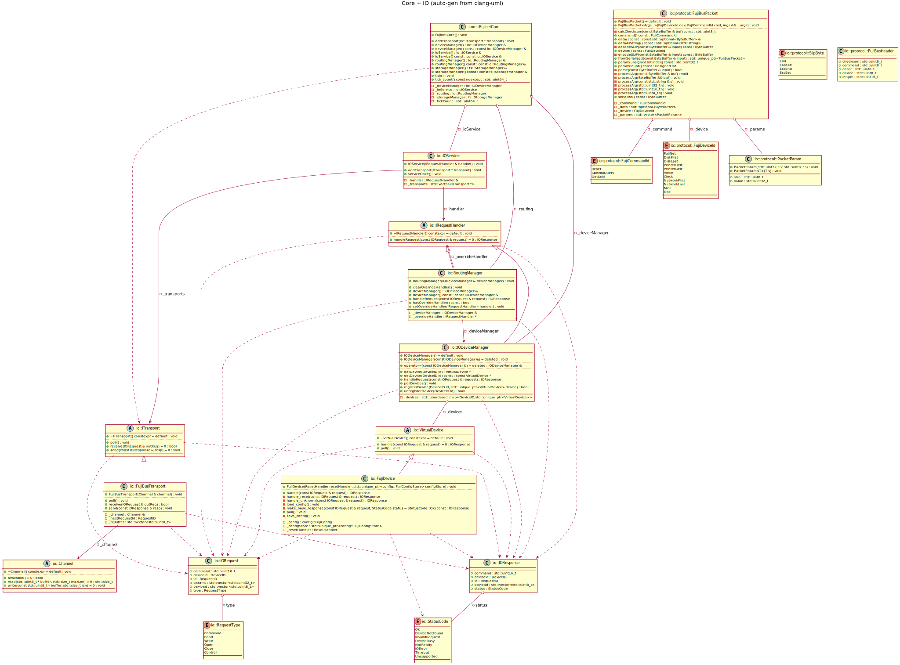

# **FujiNet-NIO Architecture Document**

*Version 1.0 — Generated 2025-12-02*

---

## **Table of Contents**
1. [Overview](#overview)  
2. [Design Principles](#design-principles)  
3. [High-Level Layered Architecture](#high-level-layered-architecture)  
4. [Data Flow: Host → Core → Device → Host](#data-flow-host--core--device--host)  
5. [Core Components](#core-components)  
   - [Channel](#1-channel-lowest-layer)  
   - [Transport](#2-transport-framing--protocol-layer)  
   - [FujiBus Protocol](#3-fujibus--slip-protocol-layer)  
   - [IODeviceManager](#4-iodevicemanager-device-routing-and-lifecycle)  
   - [VirtualDevice](#5-virtualdevice-abstract-device-api)  
   - [IOService](#6-ioservice-transport-polling--routing)  
   - [FujinetCore](#7-fujinetcore-overall-engine)  
6. [Build Profiles & Platform Abstraction](#build-profiles--platform-abstraction)  
7. [Platform Implementations](#platform-implementations)  
8. [UML Diagrams](#uml-diagrams)  
9. [Testing Strategy](#testing-strategy)  
10. [Future Enhancements](#future-enhancements)

---

# **Overview**
FujiNet-NIO is a modern, cross-platform re-implementation of the FujiNet firmware I/O architecture.

It is designed to:

- Run on **ESP32-S3 (ESP-IDF, TinyUSB)**  
- Run on **POSIX systems** (Linux/macOS)  
- Be embeddable as a **native library**  
- Work inside **emulators**  
- Compile to **WebAssembly**  
- Expose a consistent I/O layer for retro protocols (SIO, IEC, ADAMNet, RS232, etc.)

At the heart of the design is a clean separation between:

| Layer | Purpose |
|-------|---------|
| **Channels** | Raw byte I/O (USB CDC, UART, PTY…) |
| **Transports** | Framing (SLIP), FujiBus decoding/encoding |
| **Core** | Request routing, ticking, device lifecycle |
| **Devices** | Emulator-like virtual devices (Disk, Network, Printer…) |

This replaces the previous system’s macro-heavy, platform-entangled architecture.

---

# **Design Principles**

### ✔ 1. **No `#ifdef` spaghetti**
Platform differences are isolated behind:
- **Build Profiles**
- **Channel Factories**
- **Polymorphic interfaces**

### ✔ 2. **Explicit, testable boundaries**
Every layer has a narrow API:
- Channel → raw bytes  
- Transport → IORequest/IOResponse  
- Device → business logic  

This enables simulation, fuzzing, and coverage testing.

### ✔ 3. **Protocol correctness**
FujiBus and SLIP are treated as first-class protocol layers with their own implementation and tests.

### ✔ 4. **Zero shared state**
Devices don’t know about transports.  
Transports don’t know about devices.  
Everything flows through the core.

### ✔ 5. **Cross-platform reproducibility**
The same business logic (devices, parsing, routing) runs identically on ESP32 and POSIX.

---

# **High-Level Layered Architecture**

```
 ┌──────────────────────────────────────────────┐
 │                 Host System                   │
 │  (Atari, C64, Coleco, Emulator, Test Script)  │
 └──────────────────────────────────────────────┘
                      │
                      ▼
           **Channel (raw byte I/O)**
    USB CDC, UART, PTY, WebUSB, Emulator pipes
                      │
                      ▼
      **Transport (Framing + FujiBus decode)**
     - SLIP framing
     - FujiBus header parsing
     - Build IORequest
                      │
                      ▼
                **FujinetCore**
      Routing, device management, tick loop
                      │
                      ▼
            **VirtualDevice subsystem**
     Disk, Network, Printer, Fuji config, DBC, etc.
                      │
                      ▼
      Transport encodes IOResponse → Channel.write()
```

---

# **Data Flow: Host → Core → Device → Host**

### **1. Transport reads bytes from Channel**
Accumulates them in `_rxBuffer`.

### **2. SLIP frame extracted**
`Slip END` delimiters mark message boundaries.

### **3. FujiBus parsed**
- Header (device, command, length, checksum)
- Descriptor fields → parameters
- Remaining bytes → payload

Produces `IORequest`.

### **4. IOService routes request**
`IOService → IODeviceManager → VirtualDevice`.

### **5. Device returns IOResponse**
Device-specific payload, status codes, and optional data.

### **6. Transport SLIP-encodes response**
Writes bytes via `Channel.write()`.

---

# **Core Components**

---

## **1. Channel (lowest layer)**

### Purpose
Raw unframed byte I/O.

### API
```
class Channel {
public:
    virtual bool available() = 0;
    virtual std::size_t read(uint8_t*, std::size_t) = 0;
    virtual void write(const uint8_t*, std::size_t) = 0;
    virtual ~Channel() = default;
};
```

### Implementations
| Platform | Channel |
|----------|---------|
| POSIX | `PtyChannel` |
| ESP32-S3 | `UsbCdcChannel` |
| Future | WebUSB, UART, emulator pipes |

Channels do **not** know about FujiBus, SLIP, or devices.  
They are portable and trivial to test.

---

## **2. Transport (framing + protocol layer)**

Current: `Rs232Transport` (will be renamed `FujiBusTransport`)

### Responsibilities
- maintain `_rxBuffer`
- accumulate incoming bytes
- find SLIP message boundaries
- decode SLIP
- parse FujiBus header + descriptors
- construct `IORequest`
- return `IOResponse` → SLIP + FujiBus encode

```
bool poll();
bool receive(IORequest&);
void send(const IOResponse&);
```

Transports handle the **wire protocol**, not device logic.

---

## **3. FujiBus & SLIP Protocol Layer**

### Namespacing
```
namespace fujinet::io::protocol {
    enum class SlipByte : uint8_t { ... };
    uint8_t to_byte(SlipByte b);
}
```

### FujiBusPacket
Handles:
- encodeSLIP()
- decodeSLIP()
- header, checksum
- descriptors → parameters
- payload

Used directly by transports.

---

## **4. IODeviceManager (device routing and lifecycle)**

### Responsibilities
- Register/unregister devices
- Lookup device by DeviceID
- Forward IORequests
- Poll all devices each tick

### API
```
bool registerDevice(DeviceID, unique_ptr<VirtualDevice>);
bool unregisterDevice(DeviceID);
VirtualDevice* getDevice(DeviceID);

IOResponse handleRequest(const IORequest&);
void pollDevices();
```

---

## **5. VirtualDevice (abstract device API)**

### API
```
class VirtualDevice {
public:
    virtual IOResponse handle(const IORequest&) = 0;
    virtual void poll() {}
    virtual ~VirtualDevice() = default;
};
```

Example concrete devices:
- FujiDevice (core config, WiFi config)
- DiskDevice
- NetworkDevice
- PrinterDevice
- DBCDevice

---

## **6. IOService (transport polling + routing)**

### Responsibilities
- Collect requests from transports
- Route to device manager
- Send responses

### API
```
IOService(IRequestHandler&);
void addTransport(ITransport*);
void serviceOnce();
```

---

## **7. FujinetCore (overall engine)**

```
class FujinetCore {
    uint64_t         _tickCount;
    IODeviceManager  _deviceManager;
    RoutingManager   _routing;
    IOService        _ioService;
};
```

### tick()
```
serviceOnce on IOService
pollDevices on IODeviceManager
tickCount++
```

Core does *not* know the protocol—transports handle that.

---

# **Build Profiles & Platform Abstraction**

Build profile determines:
- Target machine type (Atari, C64, Generic)
- Primary transport
- Channel factory to use

```
namespace fujinet::config {
    BuildProfile current_build_profile();
}
```

Profile examples:
```
FN_BUILD_ATARI → Transport=SIO
FN_BUILD_RS232 → Transport=SerialDebug
Default POSIX  → Transport=SerialDebug
```

Platform factory selects correct Channel:
```
platform::posix::create_channel_for_profile()
platform::esp32::create_channel_for_profile()
```

This prevents all `#ifdef` pollution.

---

# **Platform Implementations**

---

## **POSIX**
- `PtyChannel` using `openpty()`
- Used with minicom or test scripts
- Good for fuzzing & protocol debugging

---

## **ESP32-S3**
- `UsbCdcChannel` using TinyUSB (Backend: CDC ACM)
- Receives/returns binary FujiBus packets over USB
- Debug UART remains on CDC0, FujiNet traffic on CDC1

Initialization is handled in:
```
platform/esp32/channel_factory.cpp
```

---

# **UML Diagrams**

- Layered architecture  
- Request/Response sequence flow  
- FujiBus protocol class diagram  
- Core class relationships  

## Generated architecture diagrams




---

# **Testing Strategy**

## Unit Tests
- SLIP encode/decode
- FujiBusPacket parsing
- Device logic
- Routing (device registration, removal, fallback)

## Integration Tests (POSIX)
- PTY tests using Python script
- Full round-trip packet validation

## ESP32 Hardware Tests
- USB CDC packet loopback
- Real Fuji commands → FujiDevice

## Emulator Tests
- Use channel mocked via pipes
- Deterministic execution

---

# **Future Enhancements**

### 1. Rename `Rs232Transport` → `FujiBusTransport`
Reflects real function (parsing FujiBus, not RS232).

### 2. Multi-transport support
SIO + USB simultaneously.

### 3. WebAssembly build target
Expose Channel via JS → WASM layer.

### 4. Better routing (RoutingManager)
Support multiple transports, overrides for devices.

### 5. Device hotplug
Allow dynamic addition/removal of VirtualDevices.

### 6. Rich error reporting
Map FujiBus error conditions → internal StatusCodes.

---
